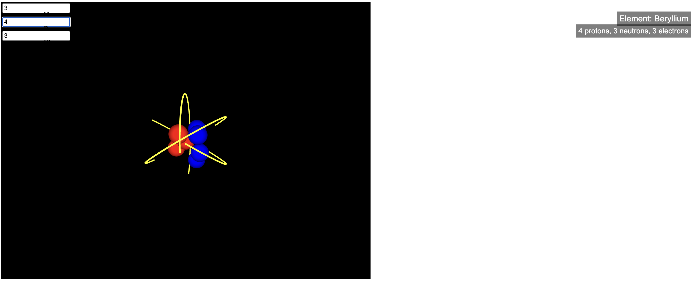

# 3D Atom Model Visualization

An interactive 3D visualization of an atom model using p5.js. Users can input the number of protons, neutrons, and electrons to see the corresponding atom structure and identify the element from the periodic table.

## Setup Instructions
1. Clone the repository or download the files.
2. Serve the files locally using a tool like Python's `http.server` or VS Code's Live Server.
3. Open your browser and navigate to the local server address (e.g., `http://localhost:8000`).

- Alternatively you can just go to the index.html in a browser and it should work fine

## Usage
- Enter the number of protons, neutrons, and electrons in the input fields.
- Observe the 3D model update in real-time.
- The element name and particle counts are displayed on the screen.

## Dependencies
- p5.js (included via CDN)

## Educational Value
This project serves as an educational tool to help users understand atomic structure and how the number of protons determines the element. It visually demonstrates the composition of atoms and their corresponding elements on the periodic table.

## Credits
- p5.js library
- Periodic table data sourced from Grok
- Mathematical modeling done by Grok (xAI)